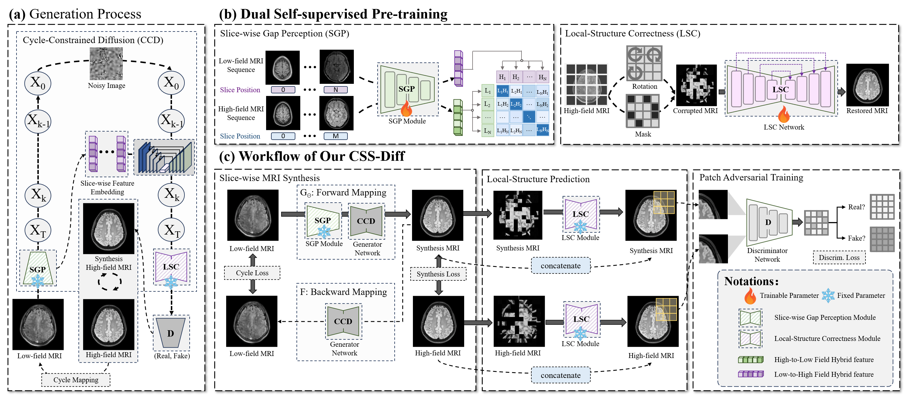

# CSS-Diff: Cyclic Self-Supervised Diffusion for Ultra Low-field to High-field MRI Synthesis

This repository provides the code accompanying the manuscript:

> **Cyclic Self-Supervised Diffusion for Ultra Low-field to High-field MRI Synthesis.**  
> Zhenxuan Zhang*, Peiyuan Jing*, Zi Wang, Ula Briski, Coraline Beitone, Yue Yang,  
> Yinzhe Wu, Fanwen Wang, Liutao Yang, Jiahao Huang, Zhifan Gao, Zhaolin Chen,  
> Kh Tohidul Islam, **Guang Yang†**, **Peter J. Lally†**  
> (* equal contribution, † corresponding authors)

---

## Overview

Low-field MRI (≤ 0.5T) is attractive due to its lower cost, portability, and accessibility, but typically suffers from reduced SNR, lower spatial resolution, and degraded anatomical fidelity compared to high-field MRI. These limitations hinder its clinical utility.

To address this gap, we propose **CSS-Diff (Cyclic Self-Supervised Diffusion)**, a diffusion-based framework that synthesizes high-field-like MRI from real low-field inputs while aiming to preserve anatomical structure and reduce hallucinations.

CSS-Diff incorporates:
- **Cycle-Constrained Diffusion (CCD)** to enforce bidirectional consistency and stabilize generation,
- **Slice-wise Gap Perception (SGP)** to improve inter-slice coherence, and  
- **Local-Structure Correctness (LSC)** to refine fine-grained anatomical details.

---

## Framework (Fig. 2)



**Figure 2.** Schematic of the CSS-Diff framework.  
- **CCD** enforces cycle consistency along the diffusion trajectory.  
- **SGP** models slice-wise relationships to mitigate through-plane inconsistencies.  
- **LSC** performs patch-level structural correction to enhance local fidelity.  
- The overall pipeline integrates diffusion-based synthesis with local structural refinement and patch-level adversarial training.

---

## Repository Structure

CSS-Diff/
├── models/ # Network architectures (SGP, LSC, diffusion modules)
├── datasets/ # Data loading and preprocessing
├── options/ # Training and testing configurations
├── train.py # Training script
├── test.py # Evaluation script
├── scripts/ # Utility scripts
├── requirements.txt # Dependencies
├── fig2_r1.png # Main framework figure
└── README.md # This file


---

## Getting Started

Install dependencies:
```bash
pip install -r requirements.txt
Train:

python train.py --name css_diff \
  --config train_configs/t1_pair_train_pss.yaml
Test:

python test.py --name css_diff \
  --config test_configs/t1_test_pss.yaml
```

(Modify config files in train_configs/ and test_configs/ as needed.)

## Data
Raw MRI data is not included in this repository due to privacy and licensing restrictions. Please contact the corresponding authors for collaboration inquiries.

## Citation
If you use this code, please cite our work:

@article{zhang2025cssdiff,
  title={Cyclic Self-Supervised Diffusion for Ultra Low-field to High-field MRI Synthesis},
  author={Zhang, Zhenxuan and Jing, Peiyuan and Wang, Zi and Beitone, Coraline and others},,
  year={2025}
}

## Contact
Zhenxuan Zhang — zhenxuan.zhang@imperial.ac.uk

Guang Yang — g.yang@imperial.ac.uk

Department of Bioengineering, Imperial College London